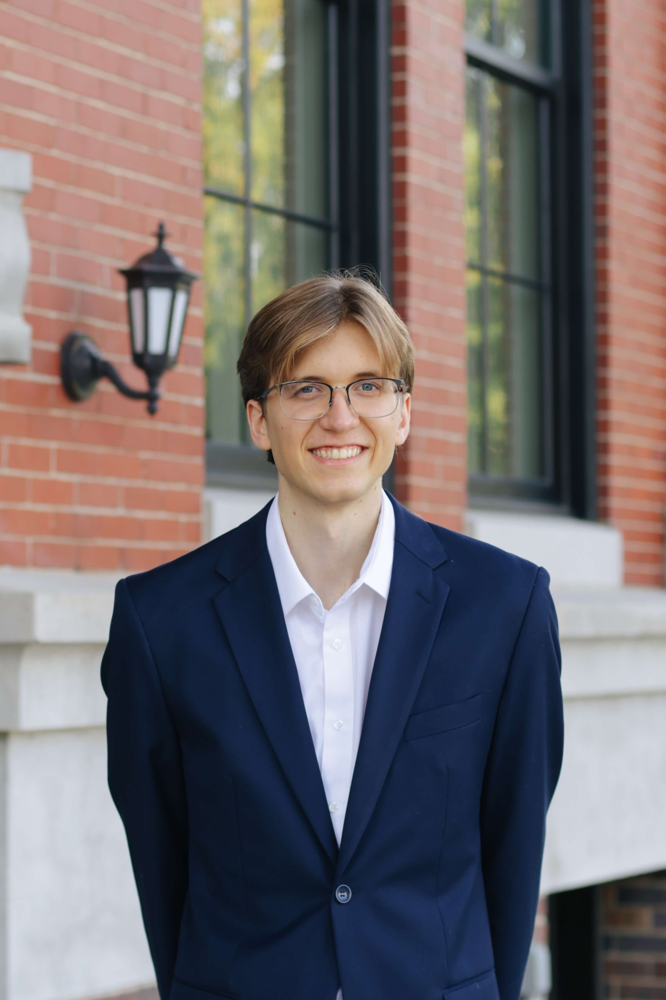
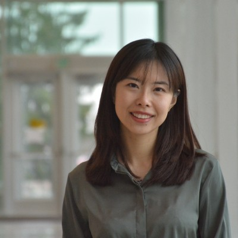

***
 

# About

The Bayesian Statistics Training (BST) provides workshops and hands-on data analytics for those who are interested in Bayesian approach to statistical inference. The workshop introduces the fundamental of Bayesian statistics and modeling in the context of epigenomics and public health, such as choice of prior distribution and posterior computation. The examples and projects are done using R programming. 

The BST aims to support students in learning emerging skillset in the field of Bayesian statistics and data science through workshops and undergraduate research. The BST also connects students with resources to advance their skills in statistics and data science. The students will have opportunities to explore and navigate career paths and learn more about the Statistics and Data Science graduate programs at Western Michigan University.

---

# Our Team

:::::::::::::: {.columns}
::: {.column width="25%"}

{#id .class width=180 height=150px}

 

{#id .class width=180 height=150px}

 

{#id .class width=180 height=150px}

 

{#id .class width=180 height=150px}

:::
::: {.column width="5%"}

:::
::: {.column width="60%"}

<b>Dr. Duy Ngo. </b>  
Assistant Professor of Statistics.

       
<b>Han Kha. </b>  
Ph.D. Student in Statistics.

      
<b> Maximilian Charles Zalewski. </b>  
Undergraduate Student.

       
<b> Alejandro Apud de la Fuente. </b>  
Undergraduate Student.

:::
::::::::::::::

  

### Alumni

:::::::::::::: {.columns}
::: {.column width="25%"}

{#id .class width=180 height=150px}

 

{#id .class width=180 height=150px}

:::
::: {.column width="5%"}

:::
::: {.column width="60%"}

<b>Daniel Quartey, Ph.D. </b>  
Medtronic.

       
<b>Xi Qiao, Ph.D. </b>  
Research Assistant Professor.  </b>  
Department of Internal Medicine, Division of Epidemiology, University of Utah.

:::
::::::::::::::

   

---

 The Bayesian Statistics Training is sponsored by the U.S. <b> National Science Foundation</b>. 

    

