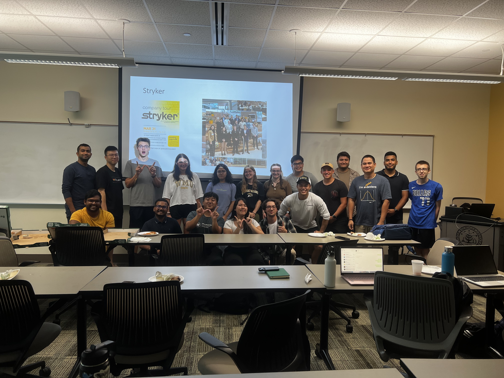
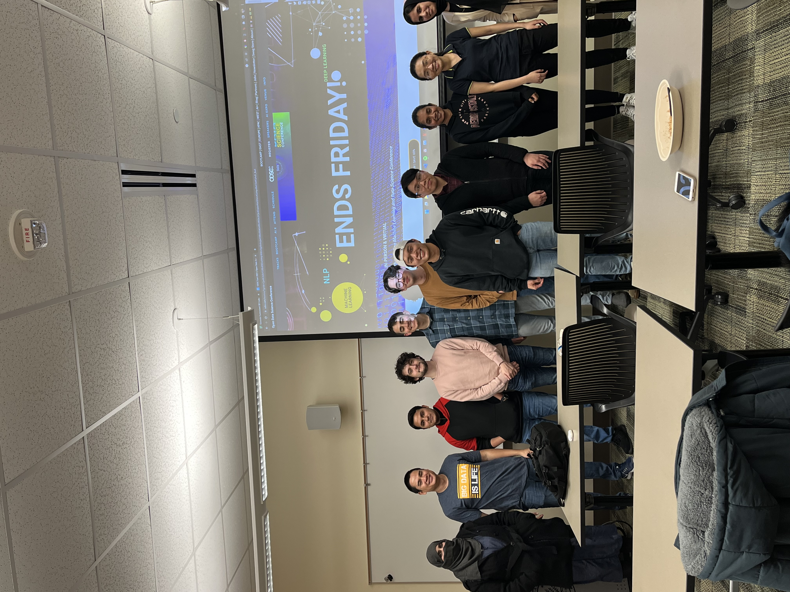
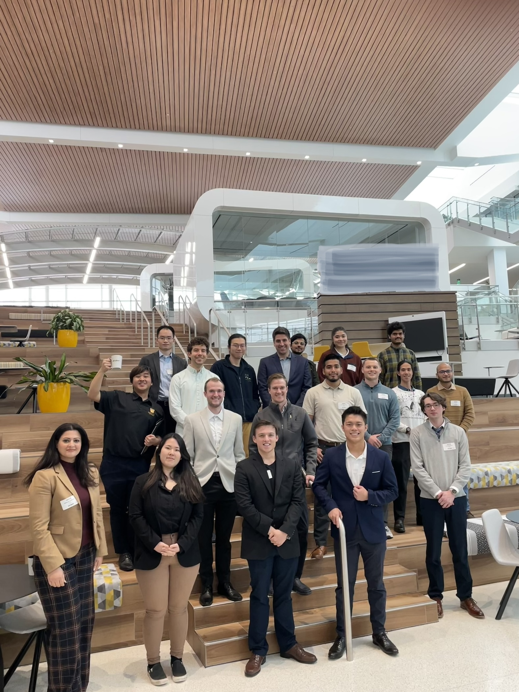

***
 

# Home

The WMU Data Science club is a student organization which gathers students interested in data science and statistics. Besides students from Data Science program, this club has a variety of other majors, such as mathematics, business, social science, computer science and engineering. 

The club aims to support students in learning emerging skillset in the field of data science through workshops and boot camps. The club also connects students with resources to advance their skills in data science and statistics. 

---

# Bayesian Statistics Training (BST)

The BST provides workshops and hands-on data analytics for those who are interested in Bayesian approach to statistical inference. The workshop introduces the fundamental of Bayesian statistics and modeling in the context of epigenomics and public health, such as choice of prior distribution and posterior computation. The examples and projects are done using R programming. 

---

# Software

- Coming soon

---

# Activities

## Workshop 2023

  
  
   
  
  

## Meeting 2023

{width=50%}

## Meeting 2022
{width=50%}

## Company Tour
{width=50%}
